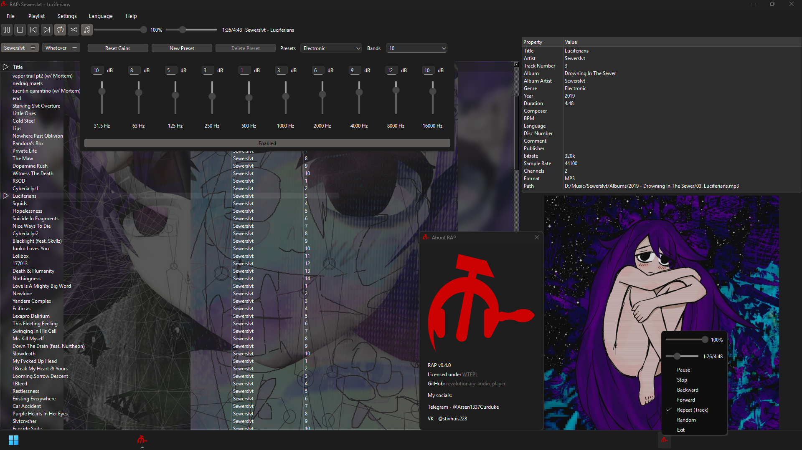

# revolutionary-audio-player/renaissance

  

РЕволюционный аудио Плеер, аббревиированный РЕП (который изначально назывался Ржавый аудио плеер, и разрабатывался с использованием gtk4-rs) и под кодовым названием Ренессанс - это _МИНИМАЛИСТИЧНЫЙ_ **_ПОЛНОФУНКЦИОНАЛЬНЫЙ_** :trollface: аудиоплеер **НОВОГО ПОКОЛЕНИЯ**.

## Особенности

-   [x] Поддержка `mp3`, `flac`, `wav`, `ogg`, `opus`, `m4a`, `mp4`, `mkv`, `aac`, `alac`, `mov`, `mka`, `ac3` (другие форматы с кастомной сборкой FFmpeg).
-   [x] Поддержка изображений обложки `png`, `jpeg`, `bmp`, `webp`, `tiff`.
-   [x] Одинаковые внешний вид и возможности на любой платформе.
-   [x] Простой интерфейс.
-   [x] Полная портабельность. Не оставляет следов в операционной системе!
-   [x] Поддержка иконки в трее по умолчанию, кнопка закрытия скрывает только окно.
    -   [x] Ползунки регулировки громкости и хода выполнения встроены **прямо в** меню в трее!
-   [x] Встроенные, готовые к использованию 3-, 5-, 10-, 18- и 30-полосные эквалайзеры с пресетами.
-   [x] Фоновые изображения плейлистов.
-   [x] Гибкая система воспроизведения, импорт / экспорт файлов `.xspf` и `.m3u8`.
-   [x] Поиск по плейлисту.
-   [x] Боковое окно метаданными.
-   [ ] Воспроизведение `.cue`.
-   [ ] Визуализатор волн.

## Зачем новый аудио плеер?

Уже есть куча аудио плееров, большинство из которых забиты ненужными вещами, или просто устарели, как неимоверно крутой плеер `foobar2000` на Windows.

Этот аудиоплеер превозносит чистый код, маленькое количество зависимостей, минималистичный интерфейс, кроссплатформенное распространение, и в целом простоту.

## Релизы

Linux билды компилируются статически на Alpine Linux с musl - для них не требуются никакие системные библиотеки.

Windows билды также компилируются статически - с ними не идёт никаких `dll` библиотек.

Скачивайте в разделе Releases.

## Билд

Вам нужен C++23-совместимый компилятор: `clang`, `gcc`, `msvc`.

Проект использует CMake как билд-систему.

Вам понадобятся `Qt6`, `FFmpeg` и `rapidhash`, чтобы забилдить проект.

Приложение было забилжено со следующей конфигурацией FFmpeg: `--enable-asm --enable-optimizations --enable-stripping --disable-debug --enable-static --disable-all --enable-avformat --enable-avcodec --enable-avfilter --enable-swresample --enable-decoder=mp3,flac,opus,aac,alac,vorbis,png,pcm_s16le,pcm_s24le,pcm_s32le,pcm_f32le,jpeg,mjpeg,bmp,webp,ac3,eac3 --enable-demuxer=mp3,flac,ogg,aac,wav,mov,matroska --enable-filter=aformat,firequalizer,aresample,alimiter --enable-protocol=file --enable-zlib`

Путь к хедерам `rapidhash` может быть указан через `-DRAPIDHASH_INCLUDE_DIRS`.

Скрипты PowerShell `build.ps1` и Bash `build.sh` используются для построения проекта в директорию `build`.

Скрипт поддерживает аргумент `-r` для билдинга в `Release` моде.

Забилденный говняк выводится в директорию `build/target`.
