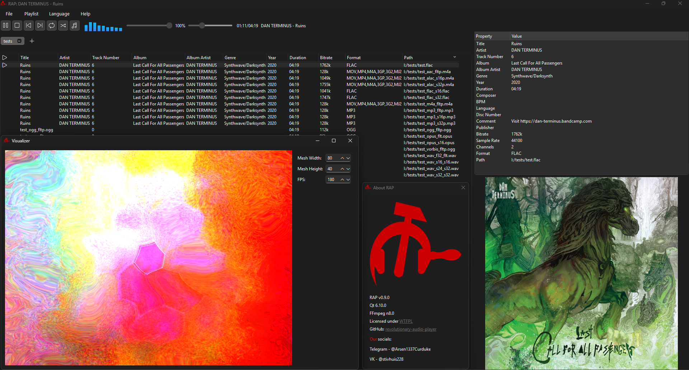

# revolutionary-audio-player/renaissance

<p align="center">
  
</p>

РЕволюционный аудио Плеер, аббревиированный РЕП (который изначально назывался Ржавый аудио плеер, и разрабатывался с использованием gtk4-rs) и под кодовым названием Ренессанс - это _МИНИМАЛИСТИЧНЫЙ_ **_ПОЛНОФУНКЦИОНАЛЬНЫЙ_** :trollface: аудиоплеер **НОВОГО ПОКОЛЕНИЯ**.



## Особенности

-   [x] Поддержка `mp3`, `flac`, `wav`, `ogg`, `opus`, `m4a`, `mp4`, `mkv`, `aac`, `alac`, `mov`, `mka`, `ac3` (другие форматы с кастомной сборкой FFmpeg).
-   [x] Поддержка изображений обложки `png`, `jpeg`, `bmp`, `webp`, `tiff`.
-   [x] Оптимизированная обработка аудио любой частоты дискретизации, до 8 каналов.
-   [x] Одинаковые внешний вид и возможности на **любой** платформе.
-   [x] Полная портабельность. Не оставляет следов в операционной системе!
-   [x] Поддержка иконки в трее по умолчанию, кнопка закрытия скрывает только окно.
    -   [x] Ползунки регулировки громкости и хода выполнения встроены **прямо в** меню в трее!
-   [x] Встроенные, готовые к использованию 3-, 5-, 10-, 18- и 30-полосные эквалайзеры с пресетами.
-   [x] Гибкая система плейлистов с:
    -   [x] Поиском треков.
    -   [x] Фоновыми изображениями плейлистов.
    -   [x] Импорт / экспорт плейлистов `.xspf`, `.m3u`, `.m3u8` и `.cue`.
    -   [x] Боковым окном с метаданными.
-   [x] Возможность выбирать **отрезок трека** для его проигрывания.
-   [x] Визуализатор пиков.
-   [x] Невероятный визуализатор в стиле WinAMP.

## Зачем новый аудио плеер?

Уже есть куча аудио плееров, большинство из которых забиты ненужными вещами, или просто устарели, как неимоверно крутой плеер `foobar2000` на Windows.

Этот аудиоплеер превозносит чистый код, маленькое количество зависимостей, минималистичный интерфейс, кроссплатформенное распространение, и в целом простоту.

## Релизы

Можете скачать их в секции **Releases**.

### Пресеты визуализатора

Мы не поставляем никаких пресетов с наши визуализатором.

Вот где можно получить пресеты, из [репозитория projectM](https://github.com/projectM-visualizer/projectm):

-   [Пак Cream of the Crop](https://github.com/projectM-visualizer/presets-cream-of-the-crop) - Коллекция из около 10К пресетов, собранная Jason Fletcher. На данный момент, стандартный набор пресетов projectM.
-   [Классические пресеты projectM](https://github.com/projectM-visualizer/presets-projectm-classic) - Чуть более чем 4К пресетов, поставляемых с прошлыми версиями projectM.
-   [Пресеты Milkdrop 2](https://github.com/projectM-visualizer/presets-milkdrop-original) - Оригинальная коллекция пресетов, поставляемая с Milkdrop и Winamp.
-   [Пресеты En D](https://github.com/projectM-visualizer/presets-en-d) - About 50 presets created by "En D".

Вместе с projectM, включены колллекции bltc201, Milkdrop 1 и 2, projectM, tryptonaut и yin. Эти пресеты можно взять [здесь](http://spiegelmc.com/pub/projectm_presets.zip).

Вы также можете скачать гигантское количество 130к+ пресетов из МегаПака [здесь](https://drive.google.com/file/d/1DlszoqMG-pc5v1Bo9x4NhemGPiwT-0pv/view) (4.08ГБ архив, текстуры включены).

### Linux

К сожалению, нам пришлось прекратить билдить статические бинарные файлы с Alpine. Основной причиной является огромное количество аудио бэкэндов (ALSA, PulseAudio, PipeWire, OSS, и так далее), и невозможность забилдить их все статически и залинковать к программе. Мы пытались залинковать только их динамически, а всё остальное статически, но таким образом динамический линкинг затрагивает и библиотеки musl libc, которых нет на большинстве дистибутивов.

Вам понадобятся следующее библиотеки, чтобы беспрепятственно запустить плеер:

-   GNU libc
    -   libc
    -   libstdc++
    -   libgcc_s
    -   libm
    -   librt
    -   ld-linux
-   libX11
    -   libXau
    -   libXdmcp
-   libxcb
    -   libxcb-cursor
    -   libxcb-icccm
    -   libxcb-image
    -   libxcb-keysyms
    -   libxcb-randr
    -   libxcb-render-util
    -   libxcb-shm
    -   libxcb-sync
    -   libxcb-xfires
    -   libxcb-render
    -   libxcb-shape
    -   libxcb-xkb
    -   libxcb-xinput
    -   libxcb-util
    -   libICE
    -   libSM
-   libxkbcommon
    -   libxkbcommon-x11
-   libffi
-   libOpenGL
    -   libGLX
    -   libEGL
    -   libGLdispatch
-   libwayland
    -   libwayland-client
    -   libwayland-cursor
    -   libwayland-egl

На разных дистрибутивах, они получаются по разному:

```bash
# Debian, основанные на Debian (Ubuntu, Kubuntu и т.д.)
sudo apt update
sudo apt install -y \
    libxkbcommon-x11-0 \
    libxkbcommon0 \
    libxcb-cursor0 \
    libxcb-icccm4 \
    libxcb-image0 \
    libxcb-keysyms1 \
    libxcb-randr0 \
    libxcb-render-util0 \
    libxcb-shm0 \
    libxcb-sync1 \
    libxcb-xfixes0 \
    libxcb-render0 \
    libxcb-shape0 \
    libxcb-xkb1 \
    libxcb-xinput0 \
    libxcb1 \
    libxcb-util1 \
    libxau6 \
    libxdmcp6 \
    libsm6 \
    libice6 \
    libc6 \
    libstdc++6 \
    libgcc-s1 \
    libffi8 \
    libglx0 \
    libopengl0 \
    libegl1 \
    libgl1 \
    libwayland-client0 \
    libwayland-cursor0 \
    libwayland-egl1

# Arch, основанные на Arch (Endeavour, Cachy), Manjaro
sudo pacman -Syu --needed \
    libxkbcommon-x11 \
    libxkbcommon \
    libxcb \
    xcb-util-cursor \
    xcb-util-keysyms \
    xcb-util-wm \
    libxau \
    libxdmcp \
    gcc-libs \
    glibc \
    libffi \
    libglvnd \
    wayland

# Alpine
apk add \
    libxkbcommon-x11 \
    libxkbcommon \
    libxcb \
    xcb-util \
    xcb-util-cursor \
    xcb-util-keysyms \
    xcb-util-wm \
    xcb-util-image \
    libxau \
    libxdmcp \
    libc6-compat \
    libstdc++ \
    gcc \
    musl \
    libffi \
    libglvnd \
    wayland-libs-client \
    wayland-libs-cursor


# OpenSUSE
sudo zypper install -y \
    libxkbcommon-x11-0 \
    libxkbcommon0 \
    libxcb-cursor0 \
    libxcb-icccm4 \
    libxcb-image0 \
    libxcb-keysyms1 \
    libxcb-randr0 \
    libxcb-render-util0 \
    libxcb-shm0 \
    libxcb-sync1 \
    libxcb-xfixes0 \
    libxcb-render0 \
    libxcb-shape0 \
    libxcb-xkb1 \
    libxcb-xinput0 \
    libxcb1 \
    libxcb-util1 \
    libXau6 \
    libXdmcp6 \
    libsm6 \
    libice6 \
    glibc \
    libstdc++6 \
    libgcc_s1 \
    libffi8 \
    libGLX0 \
    libEGL1 \
    libOpenGL0 \
    libGLdispatch0 \
    libwayland-client0 \
    libwayland-cursor0 \
    libwayland-egl1
```

Также, вам понадобиться совместимый с PulseAudio бэкэнд. Это либо сам PulseAudio, либо PipeWire-pulse.

```bash
# PipeWire-pulse

## Debian, основанные на Debian (Ubuntu, Kubuntu и т.д.)
sudo apt install libpipewire-0.3-0 libpipewire-0.3-modules

## Arch, основанные на Arch (Endeavour, Cachy), Manjaro
sudo pacman -S pipewire pipewire-pulse

## Alpine
sudo apk add pipewire-libs pipewire-pulse

## OpenSUSE
sudo zypper install libpipewire-0_3 pipewire-pulseaudio

# PulseAudio

## Debian, основанные на Debian (Ubuntu, Kubuntu и т.д.)
sudo apt install pulseaudio pulseaudio-utils

## Arch, основанные на Arch (Endeavour, Cachy), Manjaro
sudo pacman -S pulseaudio pulseaudio-alsa

## Alpine
sudo apk add pulseaudio pulseaudio-utils

## OpenSUSE
sudo zypper install pulseaudio pulseaudio-utils
```

### Windows

Билды на Windows статические, вам не нужны никакие DLL.

Минимальная поддерживаемая версия Windows - Windows 10.

## Билдинг

Вам нужен совместимый с C++23 компилятор: `clang`, `gcc`, `msvc`. Проект использует CMake как билд-систему.

Вам понадобятся библиотеки:

-   Qt6 (>= 6.8.0)
    -   Core
    -   Concurrent
    -   Thread
    -   Network
    -   Harfbuzz
    -   Widgets
    -   GUI
    -   PNG (опционально, для поддержки PNG)
    -   JPEG (опционально, для поддержки JPEG)
    -   QtTools (опционально, для создания перевода; вам возможно придётся запатчить CMakeLists, если у вас нет qtlinguist)
    -   QtImageFormats (опционально, для поддержки WEBP/TIFF)
    -   **Linux:** XCB (для плагина `qxcb`, необходимо для рисования окон в X11/Wayland), Qt6Svg (для `.svg` иконок), Wayland (опционально, для плагина `qwayland`), fontconfig (опционально, для автоматического нахождения системных шрифтов)
-   miniaudio (>= 0.11.23)
-   rapidhash
-   FFmpeg (>= 7.1.1)
    -   avformat
    -   avcodec
    -   avfilter
    -   swresample
-   libprojectM (опционально, >= 4.1.4)
    -   GLEW (опционально, зависимость Windows)

Клонируйте репозиторий: `git clone https://github.com/savannstm/revolutionary-audio-player`.

Оттуда, вы можете использовать скрипты `build.ps1` (PowerShell) и `build.sh` (Bash) чтобы забилдить проект в директорию `build`.

Скрипты поддерживают аргумент `-r` для билда в режиме `Release`.

Артефакты билда выводятся в директорию `build/target`.

Стандартные билды программы включают:

-   FFmpeg, построенный с этой конфигурацией: `--enable-asm --enable-optimizations --enable-stripping --disable-debug --enable-static --disable-all --enable-avformat --enable-avcodec --enable-avfilter --enable-swresample --enable-decoder=mp3,flac,opus,aac,alac,vorbis,png,pcm_s16le,pcm_s24le,pcm_s32le,pcm_f32le,jpeg,mjpeg,bmp,webp,ac3,eac3 --enable-demuxer=mp3,flac,ogg,aac,wav,mov,matroska,ac3,mjpeg,eac3 --enable-filter=aformat,firequalizer,aresample,alimiter --enable-protocol=file --disable-autodetect --enable-zlib`
-   Qt6, построенный с этой конфигурацией:
    -   Linux: `-static -release -nomake tests -nomake examples -nomake benchmarks -opengl desktop -system-harfbuzz -system-freetype -system-libpng -system-libjpeg -system-webp -system-tiff -system-zlib -system-doubleconversion -system-pcre -no-gtk -no-glib -no-ico -no-directfb -no-eglfs -no-gbm -no-kms -no-linuxfb -no-evdev -no-mtdev -no-tslib -no-emojisegmenter -no-cups -no-ssl -no-openssl -no-bundled-xcb-xinput -no-xcb-xlib -no-dbus -no-icu -xcb -fontconfig -gui -widgets -submodules qtbase,qtsvg,qtimageformats,qtwayland,qttools -qpa "xcb;wayland"`
    -   Windows: `-static -release -nomake tests -nomake examples -nomake benchmarks -opengl desktop -system-harfbuzz -system-freetype -system-libpng -system-libjpeg -system-webp -system-tiff -system-zlib -system-doubleconversion -system-pcre -no-emojisegmenter -no-icu -gui -widgets -submodules qtbase,qtimageformats,qttools -qpa "windows"`
