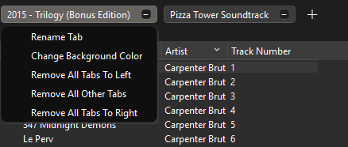
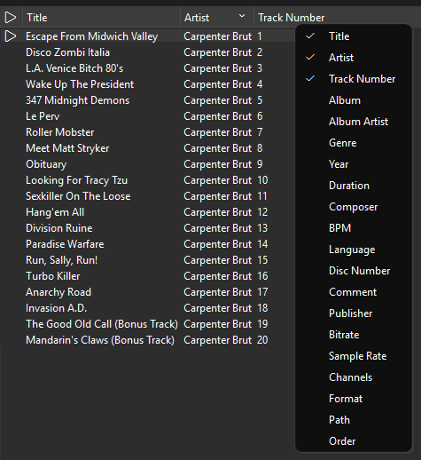
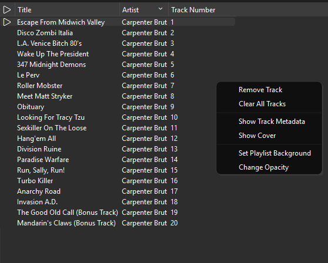
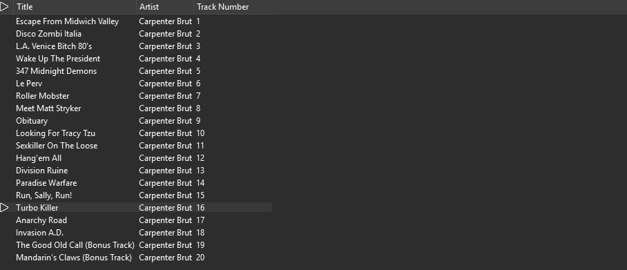

# Playlist System

As we've already discovered, RAP operates with playlists.

## Tabs

Each playlist is represented by its own tab. You can open a context menu with tab options by right-clicking the tab. From there you can rename tab, change its color, or remove other tabs.

You can also trigger tab rename by double-clicking the text of it.

Tabs are draggable, and you can freely change their order.

## Tree

Each playlist, obviously, has a tree that contains all opened tracks.

### Header

You can change header columns by right-clicking the header, then toggling options in the opened menu.

Header columns also can be reordered and resized.

### View

Tree view contains opened tracks.

By default, each view is sorted by path to the track. You can change sorting by clicking the required column. After the full sort cycle, sorting will return to sorting by path.

View also allows you to drag and reorder tracks, and this order will be preserved. You can also sort tracks by their order.

It's possible to select multiple tracks for ~~reordering~~ (WIP)/deletion by holding `Shift`/`Ctrl` when selecting the tracks.

Each playlist can have its own background, which you can select from image file, and you can also change the overall opacity of the tree view.

Track-related options include removing single or all tracks from the playlist, and checking each track metadata and cover.

### Search

You can search tracks in the tree by pressing `Ctrl + F` hotkeys.

This opens an input in the right-top part of the tree. By default, search happens by title, but there are multiple property prefixes which you can use to search something specific.

Those include:

-   `title` - Search by title
-   `artist` - Search by artist
-   `no` - Search by track number
-   `album` - Search by album
-   `albumartist` - Search by album artist
-   `genre` - Search by genre
-   `year` - Search by year/date
-   `duration` - Search by duration
-   `composer` - Search by composer
-   `bpm` - Search by BPM
-   `discnumber` - Search by disc number
-   `comment` - Search by comment
-   `publisher` - Search by publisher
-   `bitrate` - Search by bitrate
-   `samplerate` - Search by sample rate
-   `channels` - Search by channel count
-   `format` - Search by codec format
-   `path` - Search by track path
-   `order` - Search by track order in playlist

For example, you can search for Death Grips artist by `artist:Death Grips`.

