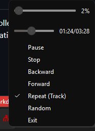

# RAP

## О RAP

Революционный аудио плеер, сокращённо RAP - это аудио плеер разработанный с учётом простоты и максимального функционала.

Эта документация покрывает все его функции, и то как использовать ВСЕ из них.

## Быстрый обзор

Когда вы впервые откроете RAP, вы не увидите никаких высплывающих окон, никаких подтверждений, ничего.

С того момента, как вы открыли плеер - он уже готов к использованию. Открывай и проигрывай, всё настолько просто.

Вот, что вам нужно знать на этом этапе:

1. _На правой стороне экрана есть док-панель_, которую можно расширять и сжимать. Она будет автоматически загружать метаданные песен и их обложки. Вы можете переместить её в другую часть экрана, или удалить внутренние элементы на выбор.
2. Настройки приложения находятся в меню `Файл > Настройки`. По-умолчанию, плеер _не оставляет никаких следов в системе_. Вы можете включить ассоциации для файлов и прочее в настройках.
3. Вы можете начать проигрывать песни _сразу же_, сбросив их в окно приложения или открыв через меню `Файл`.
4. RAP включает в себя систему проигрывания, _основанную на плейлистах_. Любой трек, который будет проигран должен быть добавлен в плейлист; новый плейлист будет создан автоматически, если такого ещё нет.
5. RAP поддерживает все _современные форматы аудиофайлов и плейлистов_ таких как `m3u`, `xspf` и `cue`. RAP НЕ поддерживает все возможные форматы файлов и НИКОГДА не будет преследовать такую цель.
6. RAP всегда сворачивается в _иконку в трее_ и должен быть закрыт оттуда.
7. RAP _не работает по принципу плагинов или модулей_. Чтобы что-то использовать, вам не нужно ничего включать в настройках. Всё включено по-умолчанию _для удобства_. Потому что зачем, скажем, необходимо _включать иконку в трее вручную_?

_Кстати, гляньте - мы поместили ползунки прямо в меню иконкии трея! (В ДАННЫЙ МОМЕНТ ТОЛЬКО ДЛЯ WINDOWS)_

## Документация в деталях

-   [Система плейлистов](./playlist.md)
-   [Настройки](./settings.md)
-   [Эквалайзер](./equalizer.md)
-   [Визуализатор в стиле WinAMP](./visualizer.md)
-   [Визуализатор спектра](./spectrum-visualizer.md)
-   [Проигрывание](./playback.md)

## Поддержите нас, пожалуйста!

Революционный аудио плеер - тяжёлый труд бедного студента колледжа из Восточной Европы. Если вы хотите поддержать этот аудио плеер, пожалуйста, подумайте над пожертвованием:

-   [Patreon](https://www.patreon.com/cw/savannstm)
-   [Boosty](https://boosty.to/mcdeimos)
-   [Ko-fi](https://ko-fi.com/savannstm)
