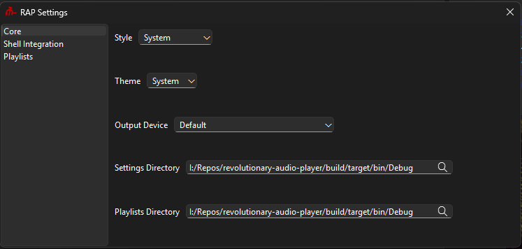
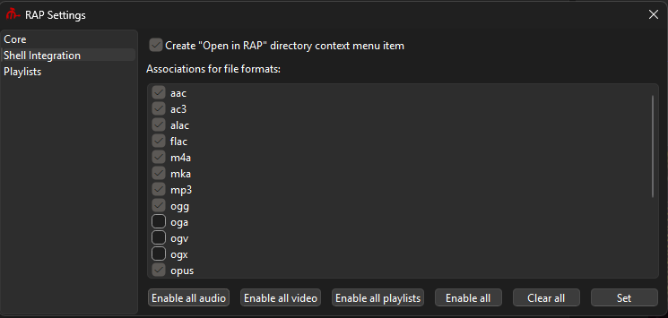

# Настройки

В данный момент, окно настроек разбито на три секции: основные настройки, настройки интеграции с оболочкой и настройки плейлистов.

## Основные

Основные настройки содержат опции, влияющие на основные аспекты программы.

-   Стиль - вы можете изменить стиль на один из доступных на вашей системе. Статические билды на Windows всегда предоставляют 4 стиля: Windows, Windows Vista, Windows 11 и Fusion. На Linux, плеер автоматически подбирает доступные плагины (как Breeze).
-   Тема - вы можете изменить тему с тёмной на светлую и наоборот. В данный момент влияет только на Windows.
-   Устройство вывода - вы можете изменить стандартное устройство вывода на какое-то определённое, например с наушников на колонки.
-   Директория настроек - локация директории настроек. Файл настроек будет хранится там между запусками программы.
-   Директория плейлистов - локация директории плейлистов. Файл плейлистов будет хранится там между запусками программы.

## Интеграция с оболочкой

Эта секция позволяет вам создать опцию в контекстных меню папок или установить ассоциации для форматов файлов.

-   Создать пункт "Открыть в RAP" в контекстном меню папок - при нажатии правой кнопкой мыши на папку, открытые контекстные меню будут иметь в себе опцию "Открыть в RAP", чтобы открывать папки в плеере.
-   Ассоциации для форматов файлов - вы можете переключить ассоциации для различных форматов, и затем установить их используя соответствующую кнопку. Отключенные ассоциации будут полностью вычищены из системы, не волнуйтесь о мусоре.

## Плейлисты

Эти настройки покрывают плейлисты и в большинстве своём косметическиею

-   Автоматически устанавливать фон плейлиста при проигрывании трека - при проигрывании трека, программа автоматически установит задний фон плейлиста, если трек включает в себя обложку.
-   Приоритизировать внешную обложку вместо включённой - при автоматической установке фона плейлиста, программа использует включённую в трек обложку по-умолчанию. Если эта опция включена, программа будет искать файл `cover.ext` высшего разрешения.
-   Наименование плейлистов - эта опция контролирует то, как будут называться открытые плейлисты.
    -   Название директории - будет использовать название открытой в программе папки. Если открыт файл, будет использовано название папки этого файла.
    -   Метаданные трека - будет использовать название альбома из метаданных трека. Если его нет, переключится на использование названия директории.
    -   Нумерованное - плейлисты будут названы по своему номеру. Если у вас открыто два плейлиста, третий будет назван "Плейлист 3". Нумерованное название используется по-умолчанию при создании пустых плейлистов.
