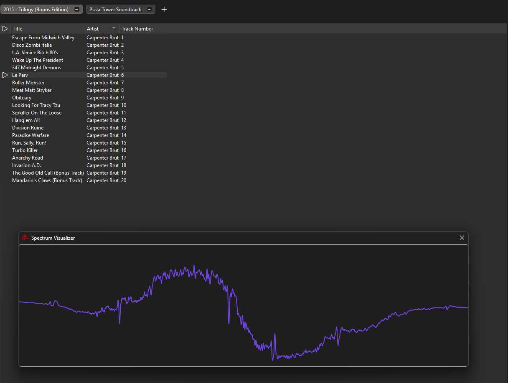

# Визуализатор спектра

Революционный аудио плеер предоставляет Революционный визуализатор спектра™ и показывает его по умолчанию.

Вы можете оставить его в основном окне или нажать на него дважды, чтобы отсоединить. Позже вы можете присоединить его заново, перекинув в основное окно.

Его настройки можно изучить нажав правой кнопкой мыши.

## Режим

Вы можете изменить режим, контролирующий способ визуализации:

-   Вершины (Относительные) - Относительные вершины, где все вершины имеют высоту относительную к высшей вершине.
-   Вершины (dBFS) - (dBFS)[https://en.wikipedia.org/wiki/DBFS] вершины.
-   Вершины (Равные) - dBFS вершины с нормализацией. Если какая-то вершина ниже 0.35, она повышается на 0.35.
-   Волны - (Волны)[https://en.wikipedia.org/wiki/Waveform] звука.

## Количество вершин

_Эта опция эксклюзивна для режимов визуализации вершин._

Позволяет вам установить количество вершин которое будет использовано при визуализации.

Эта опция как косметическая, так и нет: большее количество вершин позволяет лучше различать частоты.

В данный момент позволяет два режима: `18` и `30`.

_Это может быть изменено в v1.0_.

## Изменить расстояние между вершинами

_Эта опция эксклюзивна для режимов визуализации вершин._

Позволяет вам ввести своё расстояние между вершинами в пикселях.

## Установить фактор увеличения громкости

_Эта опция эксклюзивна для режимов визуализации вершин._

Позволяет вам установить фактор увеличения громкость в дБ для увеличения вершин.

Вершины будут увеличены на предоставленное значение.

## Пресеты

Для использования с визуализатором доступно 180 градиентов.

_Это будет расширено в v1.0_.
